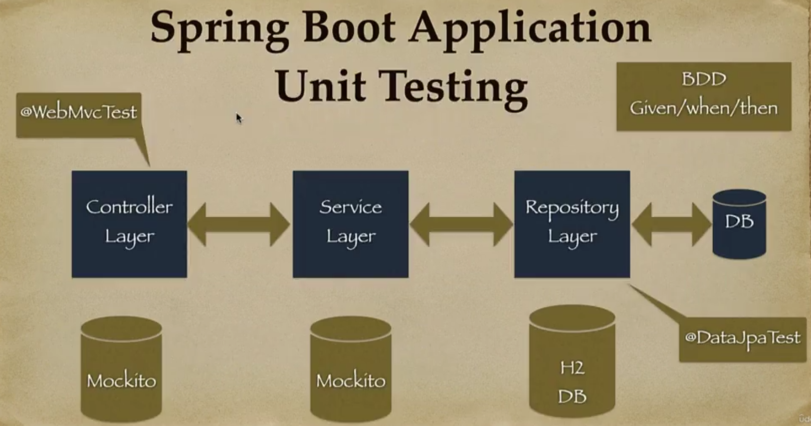
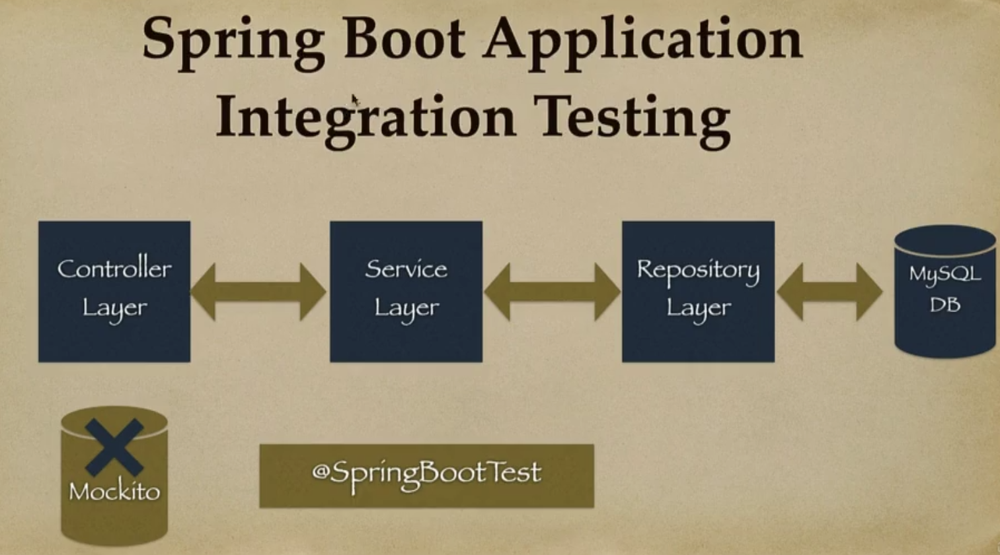
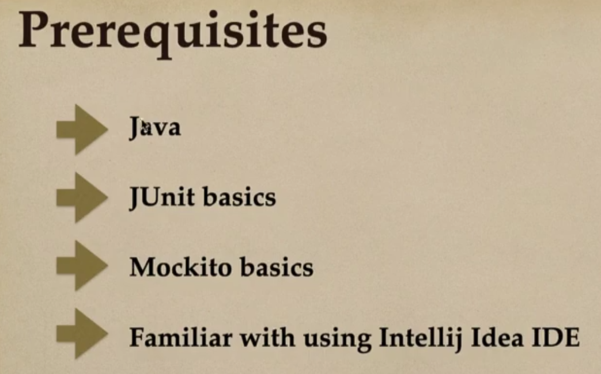
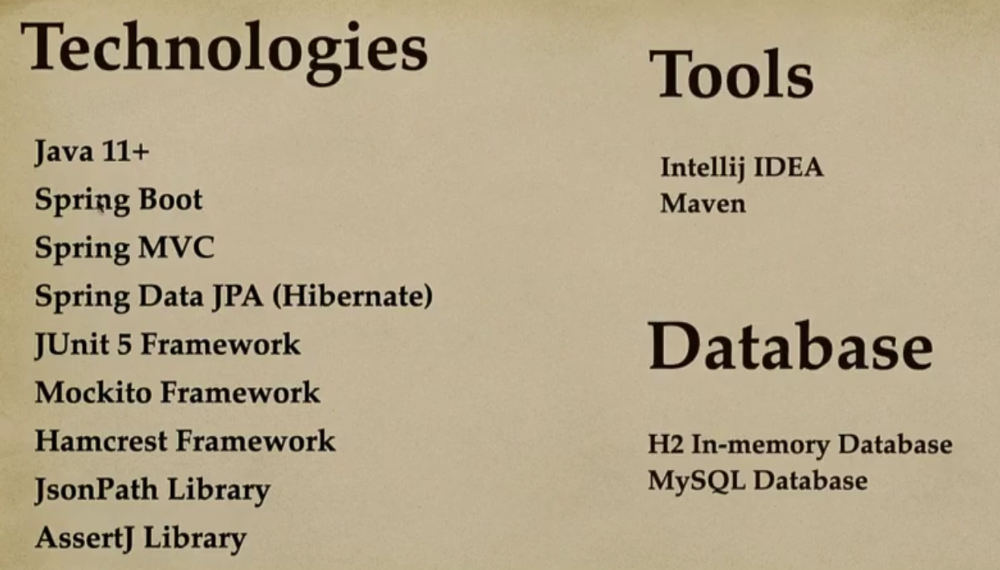
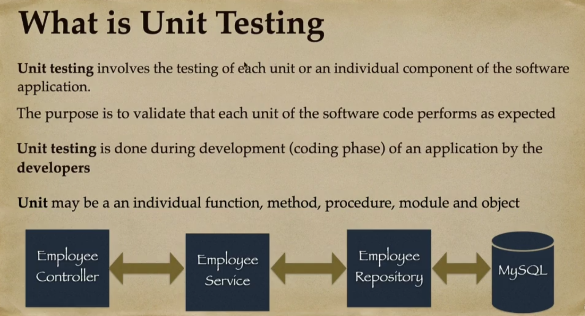

# 01 - Introduction

## 001 Course overview and roadmap

## 002 Best Way to Take This Course and How to Get Help

1. Best Way to Take this Course
Well, I generally prefer creating project-oriented courses with line-by-line coding.

So type the code along with me in the video lectures. If you follow along with me then this will enhance your learning experience.

Well, some students will watch the videos first and then replay them while typing in the code. Others like to type the code along on the first watch. Choose whatever approach works for you.

But the important thing is that you type in the code. This is the most effective way to really learn the materials.

2. How To Get Help
If you have any coding questions or have a syntax error, here's how you can get help:

1. Download the source code.

Every section of the coding videos has the solution source code attached. You can download the solution source code and compare your code against the solution source code.

2. Post a Message

If you are not able to resolve the problem, post a message to the discussion forum. Be sure to paste your Java source code along with any relevant config files.

I'm a very responsive instructor and I'll respond to your question in 24 hours.

Enjoy the course :-)

3. Tip to get interview calls
Complete this course and share the Udemy certificate of this course on Linkedin to get interview calls (tag me on LinkedIn to better reach)

## 003 What is Unit testing and Integration testing

## 004 Best practices for Unit testing in Java

## 005 Download Source Code

## 006 Download All the Important Lecture Notes in PDF

## 007 This Course Migrated to Spring Boot 3
