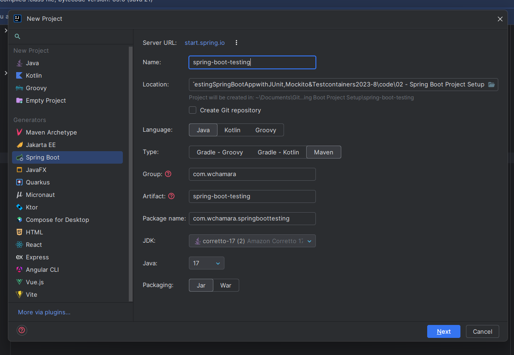
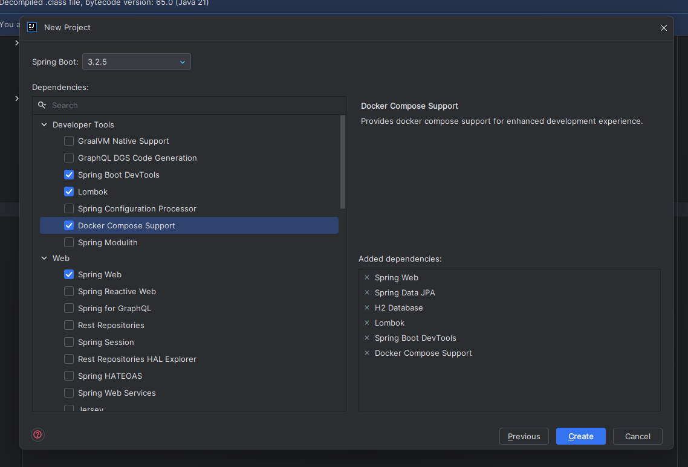
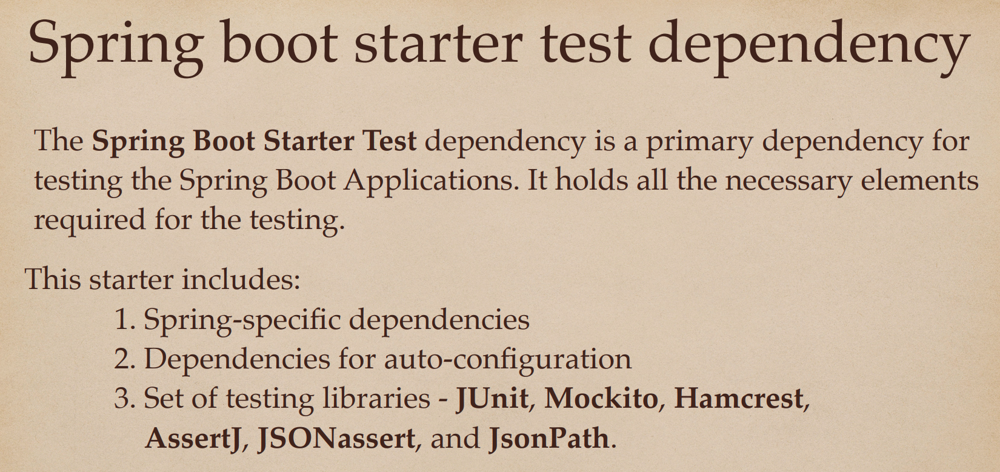
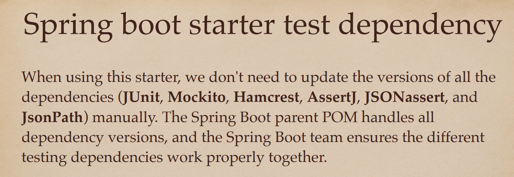
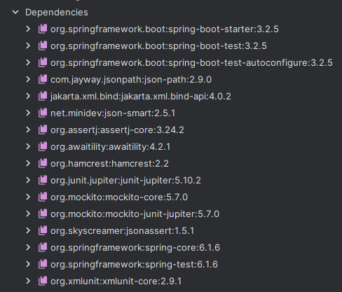
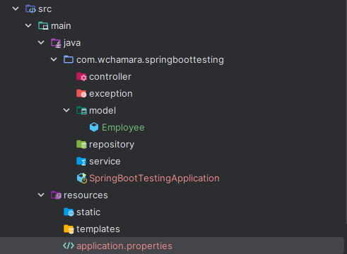
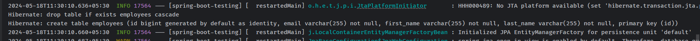

# 02 - Spring Boot Project Setup

## 001 Create and Set up Spring Boot Project in IntelliJ IDEA




```xml
/**
 * This dependency is used for testing Spring Boot applications.
 * It provides the necessary dependencies and configurations to run tests.
 * The groupId is org.springframework.boot and the artifactId is spring-boot-starter-test.
 * The scope is set to test, indicating that this dependency is only required for testing purposes.
 */
<dependency>
    <groupId>org.springframework.boot</groupId>
    <artifactId>spring-boot-starter-test</artifactId>
    <scope>test</scope>
</dependency>
```

## 002 Understanding Spring boot starter test dependency




spring-boot-starter-test is a starter for testing Spring Boot applications with libraries including JUnit, Hamcrest, and Mockito. It also provides support for TestNG with an additional starter called spring-boot-starter-testng.



```xml
<?xml version="1.0" encoding="UTF-8"?>
<project xsi:schemaLocation="http://maven.apache.org/POM/4.0.0 https://maven.apache.org/xsd/maven-4.0.0.xsd" xmlns="http://maven.apache.org/POM/4.0.0"
    xmlns:xsi="http://www.w3.org/2001/XMLSchema-instance">
  <!-- This module was also published with a richer model, Gradle metadata,  -->
  <!-- which should be used instead. Do not delete the following line which  -->
  <!-- is to indicate to Gradle or any Gradle module metadata file consumer  -->
  <!-- that they should prefer consuming it instead. -->
  <!-- do_not_remove: published-with-gradle-metadata -->
  <modelVersion>4.0.0</modelVersion>
  <groupId>org.springframework.boot</groupId>
  <artifactId>spring-boot-starter-test</artifactId>
  <version>3.2.5</version>
  <name>spring-boot-starter-test</name>
  <description>Starter for testing Spring Boot applications with libraries including JUnit Jupiter, Hamcrest and Mockito</description>
  <url>https://spring.io/projects/spring-boot</url>
  <organization>
    <name>VMware, Inc.</name>
    <url>https://spring.io</url>
  </organization>
  <licenses>
    <license>
      <name>Apache License, Version 2.0</name>
      <url>https://www.apache.org/licenses/LICENSE-2.0</url>
    </license>
  </licenses>
  <developers>
    <developer>
      <name>Spring</name>
      <email>ask@spring.io</email>
      <organization>VMware, Inc.</organization>
      <organizationUrl>https://www.spring.io</organizationUrl>
    </developer>
  </developers>
  <scm>
    <connection>scm:git:git://github.com/spring-projects/spring-boot.git</connection>
    <developerConnection>scm:git:ssh://git@github.com/spring-projects/spring-boot.git</developerConnection>
    <url>https://github.com/spring-projects/spring-boot</url>
  </scm>
  <issueManagement>
    <system>GitHub</system>
    <url>https://github.com/spring-projects/spring-boot/issues</url>
  </issueManagement>
  <dependencies>
    <dependency>
      <groupId>org.springframework.boot</groupId>
      <artifactId>spring-boot-starter</artifactId>
      <version>3.2.5</version>
      <scope>compile</scope>
    </dependency>
    <dependency>
      <groupId>org.springframework.boot</groupId>
      <artifactId>spring-boot-test</artifactId>
      <version>3.2.5</version>
      <scope>compile</scope>
    </dependency>
    <dependency>
      <groupId>org.springframework.boot</groupId>
      <artifactId>spring-boot-test-autoconfigure</artifactId>
      <version>3.2.5</version>
      <scope>compile</scope>
    </dependency>
    <dependency>
      <groupId>com.jayway.jsonpath</groupId>
      <artifactId>json-path</artifactId>
      <version>2.9.0</version>
      <scope>compile</scope>
    </dependency>
    <dependency>
      <groupId>jakarta.xml.bind</groupId>
      <artifactId>jakarta.xml.bind-api</artifactId>
      <version>4.0.2</version>
      <scope>compile</scope>
    </dependency>
    <dependency>
      <groupId>net.minidev</groupId>
      <artifactId>json-smart</artifactId>
      <version>2.5.1</version>
      <scope>compile</scope>
    </dependency>
    <dependency>
      <groupId>org.assertj</groupId>
      <artifactId>assertj-core</artifactId>
      <version>3.24.2</version>
      <scope>compile</scope>
    </dependency>
    <dependency>
      <groupId>org.awaitility</groupId>
      <artifactId>awaitility</artifactId>
      <version>4.2.1</version>
      <scope>compile</scope>
    </dependency>
    <dependency>
      <groupId>org.hamcrest</groupId>
      <artifactId>hamcrest</artifactId>
      <version>2.2</version>
      <scope>compile</scope>
    </dependency>
    <dependency>
      <groupId>org.junit.jupiter</groupId>
      <artifactId>junit-jupiter</artifactId>
      <version>5.10.2</version>
      <scope>compile</scope>
    </dependency>
    <dependency>
      <groupId>org.mockito</groupId>
      <artifactId>mockito-core</artifactId>
      <version>5.7.0</version>
      <scope>compile</scope>
    </dependency>
    <dependency>
      <groupId>org.mockito</groupId>
      <artifactId>mockito-junit-jupiter</artifactId>
      <version>5.7.0</version>
      <scope>compile</scope>
    </dependency>
    <dependency>
      <groupId>org.skyscreamer</groupId>
      <artifactId>jsonassert</artifactId>
      <version>1.5.1</version>
      <scope>compile</scope>
    </dependency>
    <dependency>
      <groupId>org.springframework</groupId>
      <artifactId>spring-core</artifactId>
      <version>6.1.6</version>
      <scope>compile</scope>
    </dependency>
    <dependency>
      <groupId>org.springframework</groupId>
      <artifactId>spring-test</artifactId>
      <version>6.1.6</version>
      <scope>compile</scope>
    </dependency>
    <dependency>
      <groupId>org.xmlunit</groupId>
      <artifactId>xmlunit-core</artifactId>
      <version>2.9.1</version>
      <scope>compile</scope>
      <exclusions>
        <exclusion>
          <groupId>javax.xml.bind</groupId>
          <artifactId>jaxb-api</artifactId>
        </exclusion>
      </exclusions>
    </dependency>
  </dependencies>
</project>

```

## 003 Create JPA Entity



```properties
spring.application.name=spring-boot-testing
spring.jpa.show-sql=true
```

```java
package com.wchamara.springboottesting.model;

import jakarta.persistence.*;
import lombok.*;

@Getter
@Setter
@NoArgsConstructor
@AllArgsConstructor
@Builder
@Entity
@Table(name = "employees")
public class Employee {
    @Id
    @GeneratedValue(strategy = GenerationType.IDENTITY)
    private long id;

    @Column(name = "first_name",nullable = false)
    private String firstName;
    @Column(name = "last_name",nullable = false)
    private String lastName;
    @Column(nullable = false)
    private String email;

}
```



## 004 Create Spring Data JPA repository

```java
package com.wchamara.springboottesting.repository;

import com.wchamara.springboottesting.model.Employee;
import org.springframework.data.jpa.repository.JpaRepository;

public interface EmployeeRepository extends JpaRepository<Employee, Long> {
}

```
