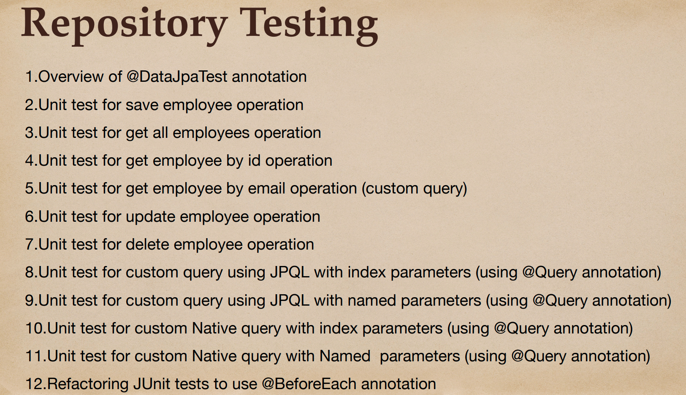

# 03 - Spring Boot - Unit Testing Repository Layer

## 001 Repository layer Unit testing overview

## 002 Spring Boot @DataJpaTest annotation

## 003 Unit test for save employee operation

## 004 Unit test for get all employees operation

## 005 Unit test for get employee by id operation

## 006 Unit test for get employee by email operation (Spring Data JPA query method)

## 007 Unit test for update employee operation

## 008 Unit test for delete employee operation

## 009 Unit test Spring Data JPA custom query method using JPQL with index parameters

## 010 Unit test Spring Data JPA custom query method using JPQL with named parameters

## 011 Unit test Spring Data JPA custom native query with index parameters

## 012 Unit test Spring Data JPA custom Native query with Named parameters

## 013 Refactoring JUnit tests to use @BeforeEach annotation
