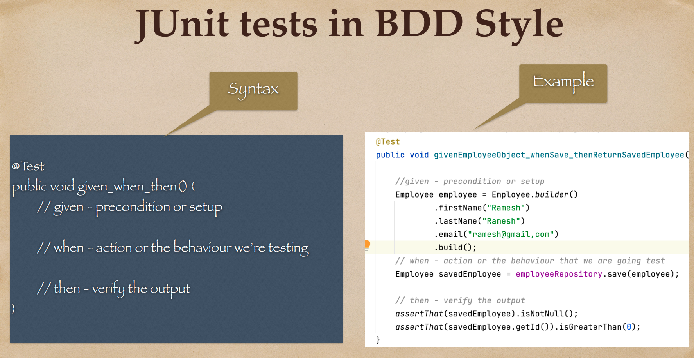

# 03 - Spring Boot - Unit Testing Repository Layer

## 001 Repository layer Unit testing overview




## 002 Spring Boot @DataJpaTest annotation


## 003 Unit test for save employee operation

```java
package com.wchamara.springboottesting.repository;

import com.wchamara.springboottesting.model.Employee;
import org.junit.jupiter.api.DisplayName;
import org.junit.jupiter.api.Test;
import org.springframework.beans.factory.annotation.Autowired;
import org.springframework.boot.test.autoconfigure.orm.jpa.DataJpaTest;

import static org.assertj.core.api.Assertions.assertThat;

/**
 * This is a test class for EmployeeRepository.
 * It uses Spring Boot's @DataJpaTest for configuration.
 * @DataJpaTest provides some standard setup needed for testing the persistence layer:
 * - configuring H2, an in-memory database
 * - setting Hibernate, Spring Data, and the DataSource
 * - performing an @EntityScan
 * - turning on SQL logging
 */
@DataJpaTest
class EmployeeRepositoryTest {
    // Autowired EmployeeRepository instance
    @Autowired
    private EmployeeRepository underTest;

    /**
     * This test case is for the Save Employee operation.
     * It uses JUnit's @DisplayName for better readability of test cases.
     * The test case follows the given-when-then pattern:
     * - given: An Employee object is created with some initial data.
     * - when: The save method of the EmployeeRepository is called with the created Employee object.
     * - then: Assertions are made to ensure that the saved Employee object is not null,
     *         its id is greater than 0 (indicating successful save operation),
     *         and the first name, last name, and email are as expected.
     */
    @DisplayName("JUnit test for Save Employee operation")
    @Test
    void givenEmployeeObject_whenSave_ThenReturnSavedEmployee() {
        // given
        Employee employee = Employee.builder()
                .firstName("Chamara")
                .lastName("Wijesekara")
                .email("abc@abc.com").build();
        // when
        Employee savedEmployee = underTest.save(employee);
        // then
        assertThat(savedEmployee).isNotNull();
        assertThat(savedEmployee.getId()).isGreaterThan(0);
        assertThat(savedEmployee.getFirstName()).isEqualTo(employee.getFirstName());
        assertThat(savedEmployee.getLastName()).isEqualTo(employee.getLastName());
        assertThat(savedEmployee.getEmail()).isEqualTo(employee.getEmail());
    }
}
```

## 004 Unit test for get all employees operation

```java
    /**
     * This test case is for the Find All Employees operation.
     * It uses JUnit's @Test annotation to indicate that this is a test method.
     * The test case follows the given-when-then pattern:
     * - given: Two Employee objects are created with some initial data and saved using the save method of the EmployeeRepository.
     * - when: The findAll method of the EmployeeRepository is called.
     * - then: Assertions are made to ensure that the returned list of Employees is not null, its size is 2 (indicating both Employees were saved and retrieved successfully),
     * and the first name, last name, and email of each Employee in the list are as expected.
     */
    @DisplayName("JUnit5 test for get all Employees operation")
    @Test
    void given_when_thenName() {
        // given - precondition or setup
        Employee employee1 = Employee.builder()
                .firstName("Chamara")
                .lastName("Wijesekara")
                .email("abc@abc.com").build();

        Employee employee2 = Employee.builder()
                .firstName("Gagani")
                .lastName("Dharika")
                .email("xds@abc.com").build();
        underTest.save(employee1);
        underTest.save(employee2);

        // when action or the behaviour we are going to test
        List<Employee> employees = underTest.findAll();
        // then verify the output
        assertThat(employees).hasSize(2);
        assertThat(employees).contains(employee1, employee2);

    }
```

## 005 Unit test for get employee by id operation

```java
 /**
     * This test case is for the Find Employee by Id operation.
     * It uses JUnit's @Test and @DisplayName annotations to indicate that this is a test method and to provide a human-readable name for the test.
     * The test case follows the given-when-then pattern:
     * - given: An Employee object is created with some initial data and saved using the save method of the EmployeeRepository.
     * - when: The findById method of the EmployeeRepository is called with the id of the saved Employee.
     * - then: Assertions are made to ensure that the returned Optional<Employee> is not empty (indicating the Employee was found successfully),
     *         and the first name, last name, and email of the found Employee are as expected.
     */
    @Test
    @DisplayName("JUnit5 test for get Employee by Id operation")
    void givenEmployeeId_whenFindById_thenReturnEmployee() {
        // given - precondition or setup
        Employee employee1 = Employee.builder()
                .firstName("Chamara")
                .lastName("Wijesekara")
                .email("abc@abc.com").build();
        Employee savedEmployee = underTest.save(employee1);
        // when action or the behaviour we are going to test
        Optional<Employee> userById = underTest.findById(savedEmployee.getId());
        // then verify the output
        assertThat(userById).isPresent();
        assertThat(userById.get().getFirstName()).isEqualTo(employee1.getFirstName());
        assertThat(userById.get().getLastName()).isEqualTo(employee1.getLastName());
        assertThat(userById.get().getEmail()).isEqualTo(employee1.getEmail());

    }
```

## 006 Unit test for get employee by email operation (Spring Data JPA query method)

```java
   /**
     * This test case is for the Find Employee by Email operation.
     * It uses JUnit's @Test annotation to indicate that this is a test method.
     * The test case follows the given-when-then pattern:
     * - given: An Employee object is created with some initial data and saved using the save method of the EmployeeRepository.
     * - when: The findByEmail method of the EmployeeRepository is called with the email of the saved Employee.
     * - then: Assertions are made to ensure that the returned Optional<Employee> is not empty (indicating the Employee was found successfully),
     * and the first name, last name, and email of the found Employee are as expected.
     */
    @Test
    void givenEmail_whenFindByEmail_thenReturnEmployee() {
        // given - precondition or setup
        Employee employee1 = Employee.builder()
                .firstName("Chamara")
                .lastName("Wijesekara")
                .email("abc@abc.com").build();
        Employee savedEmployee = underTest.save(employee1);
        // when action or the behaviour we are going to test
        Optional<Employee> byEmail = underTest.findByEmail(savedEmployee.getEmail());
        // then verify the output
        assertThat(byEmail).isPresent();
        assertThat(byEmail.get().getFirstName()).isEqualTo(employee1.getFirstName());
        assertThat(byEmail.get().getLastName()).isEqualTo(employee1.getLastName());
        assertThat(byEmail.get().getEmail()).isEqualTo(employee1.getEmail());
    }
```

## 007 Unit test for update employee operation

```java
/**
     * This test case is for the Update Employee operation.
     * It uses JUnit's @Test annotation to indicate that this is a test method.
     * The test case follows the given-when-then pattern:
     * - given: An Employee object is created with some initial data and saved using the save method of the EmployeeRepository.
     * - when: The saved Employee object is updated with new data and saved using the save method of the EmployeeRepository.
     * - then: Assertions are made to ensure that the updated Employee object is not null,
     * its id is the same as the original Employee object,
     * and the first name, last name, and email are as expected.
     */
    @DisplayName("JUnit5 test for Update Employee operation")
    @Test
    void givenEmployeeObject_whenUpdate_ThenReturnUpdatedEmployee() {
        // given
        Employee employee = Employee.builder()
                .firstName("Chamara")
                .lastName("Wijesekara")
                .email("abc@abc.com").build();
        Employee savedEmployee = underTest.save(employee);
        // when
        savedEmployee.setFirstName("Chamara Updated");
        savedEmployee.setLastName("Wijesekara Updated");
        savedEmployee.setEmail("abc@abc.com");

        Employee updatedEmployee = underTest.save(savedEmployee);

        // then
        assertThat(updatedEmployee).isNotNull();
        assertThat(updatedEmployee.getId()).isEqualTo(savedEmployee.getId());
        assertThat(updatedEmployee.getFirstName()).isEqualTo(savedEmployee.getFirstName());
        assertThat(updatedEmployee.getLastName()).isEqualTo(savedEmployee.getLastName());
        assertThat(updatedEmployee.getEmail()).isEqualTo(savedEmployee.getEmail());
    }
```

## 008 Unit test for delete employee operation

```java
    /**
     * This test case is for the Delete Employee by Id operation.
     * It uses JUnit's @Test annotation to indicate that this is a test method.
     * The test case follows the given-when-then pattern:
     * - given: An Employee object is created with some initial data and saved using the save method of the EmployeeRepository.
     * - when: The deleteById method of the EmployeeRepository is called with the id of the saved Employee.
     * - then: Assertions are made to ensure that the Employee is deleted successfully and the findById method returns an empty Optional<Employee>.
     */
    @Test
    @DisplayName("JUnit5 test for Delete Employee by Id operation")
    void givenEmployeeId_whenDeleteById_thenEmployeeShouldBeDeleted() {
        // given - precondition or setup
        Employee employee1 = Employee.builder()
                .firstName("Chamara")
                .lastName("Wijesekara")
                .email("abc@abc.com").build();
        Employee savedEmployee = underTest.save(employee1);
        // when action or the behaviour we are going to test
        underTest.deleteById(savedEmployee.getId());
        // then verify the output
        Optional<Employee> userById = underTest.findById(savedEmployee.getId());
        assertThat(userById).isEmpty();
    }

```

## 009 Unit test Spring Data JPA custom query method using JPQL with index parameters

## 010 Unit test Spring Data JPA custom query method using JPQL with named parameters

## 011 Unit test Spring Data JPA custom native query with index parameters

## 012 Unit test Spring Data JPA custom Native query with Named parameters

## 013 Refactoring JUnit tests to use @BeforeEach annotation
