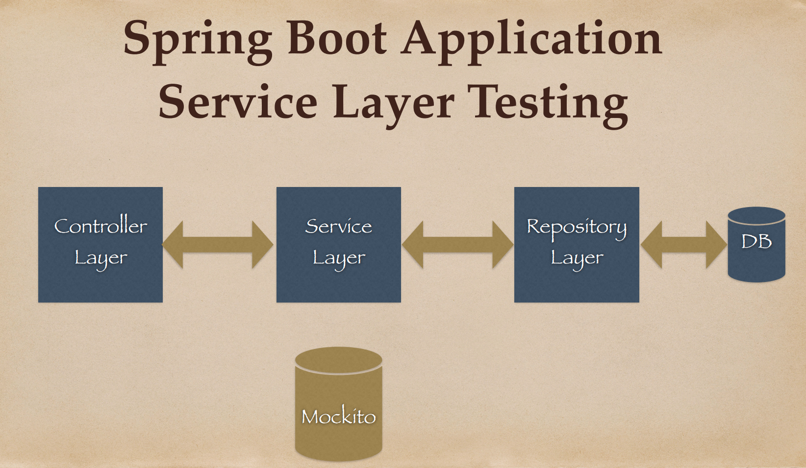
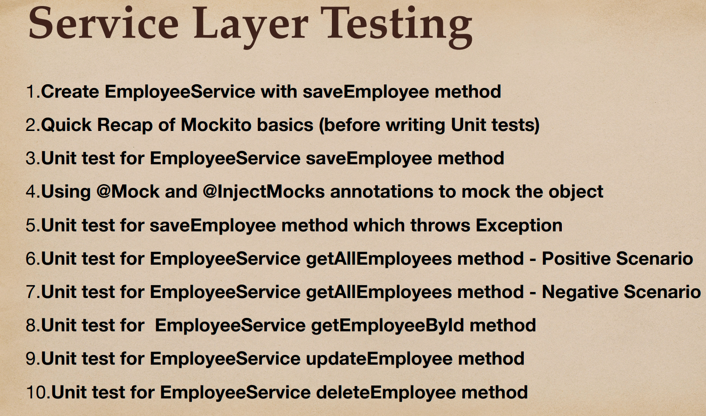
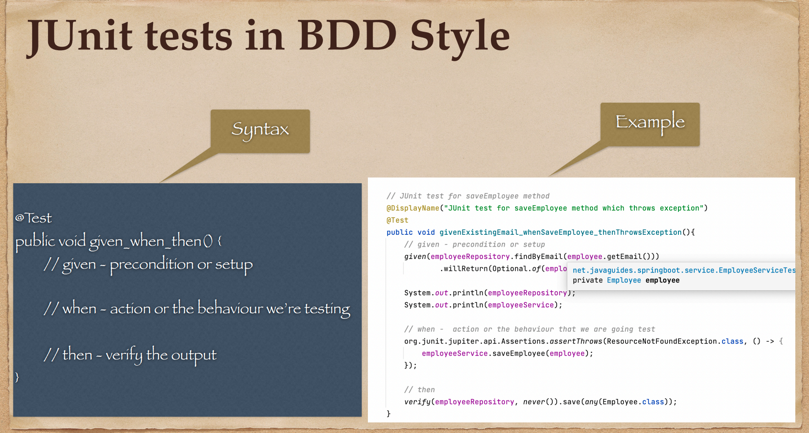
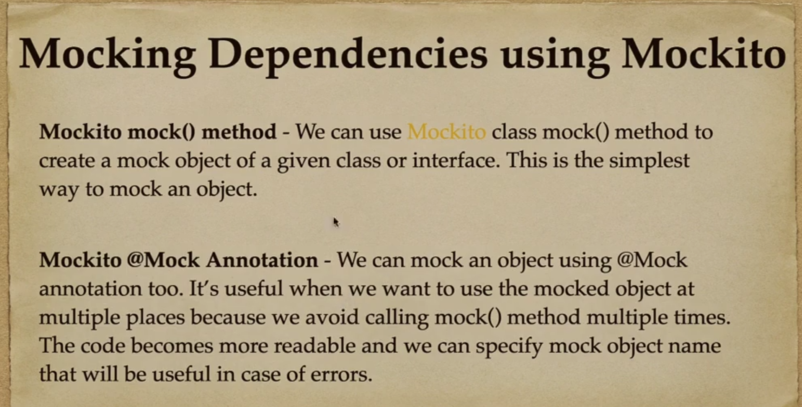
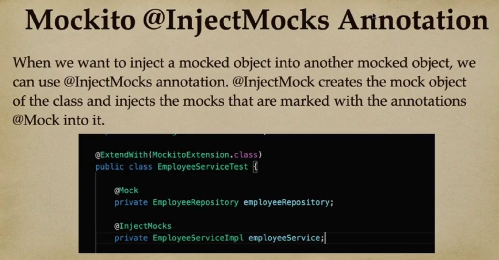
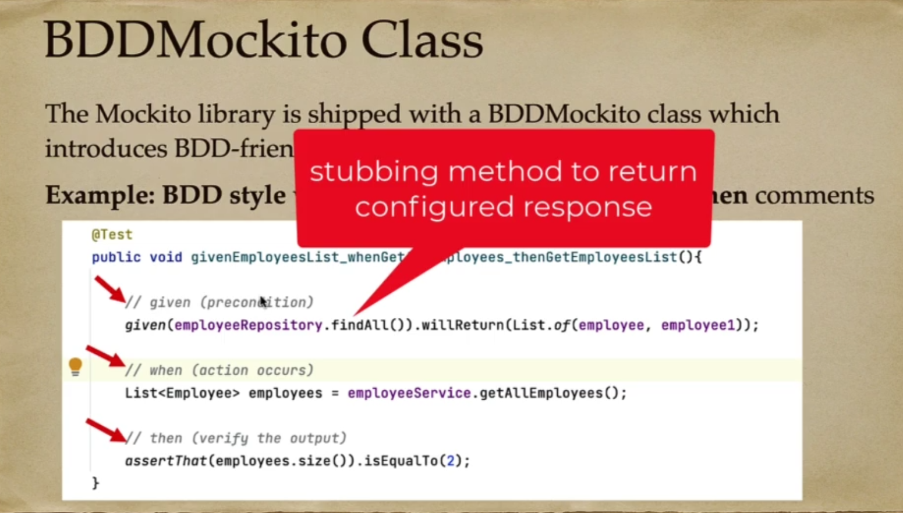

# 04 - Spring Boot - Unit Testing Service Layer

## 001 Service Layer unit testing overview





## 002 Create EmployeeService with saveEmployee method

```java
package com.wchamara.springboottesting.service.impl;

import com.wchamara.springboottesting.exception.ResourceNotFoundException;
import com.wchamara.springboottesting.model.Employee;
import com.wchamara.springboottesting.repository.EmployeeRepository;
import com.wchamara.springboottesting.service.EmployeeService;

import java.util.Optional;

/**
 * This class implements the EmployeeService interface.
 * It provides the business logic for managing Employees.
 */
public class EmployeeServiceImpl implements EmployeeService {

    /**
     * The repository for accessing the Employee data from the database.
     */
    private final EmployeeRepository employeeRepository;

    /**
     * Constructor for the EmployeeServiceImpl.
     * It takes an EmployeeRepository as a parameter and assigns it to the employeeRepository field.
     *
     * @param employeeRepository The repository for accessing the Employee data from the database.
     */
    public EmployeeServiceImpl(EmployeeRepository employeeRepository) {
        this.employeeRepository = employeeRepository;
    }

    /**
     * This method is used to save an Employee to the database.
     * It first checks if an Employee with the same id already exists in the database.
     * If an Employee with the same id already exists, it throws a ResourceNotFoundException.
     * If no Employee with the same id exists, it saves the Employee to the database and returns the saved Employee.
     *
     * @param employee The Employee to save.
     * @return The saved Employee.
     * @throws ResourceNotFoundException If an Employee with the same id already exists.
     */
    @Override
    public Employee saveEmployee(Employee employee) {

        Optional<Employee> findEmployee = employeeRepository.findById(employee.getId());

        if (findEmployee.isPresent()) {
            throw new ResourceNotFoundException("Employee already exists with given email : " + employee.getEmail());
        }
        return employeeRepository.save(employee);
    }
}
```

```java
package com.wchamara.springboottesting.exception;

/**
 * This class extends the RuntimeException class.
 * It is used to indicate that a resource was not found.
 * It can be thrown when trying to find a resource with a specific id or other unique identifier, and the resource does not exist.
 */
public class ResourceNotFoundException extends RuntimeException {

    /**
     * Constructor for the ResourceNotFoundException.
     * It takes a message as a parameter and passes it to the superclass constructor.
     * The message should provide information about the resource that was not found.
     *
     * @param message The message about the resource that was not found.
     */
    public ResourceNotFoundException(String message) {
        super(message);
    }

    /**
     * Constructor for the ResourceNotFoundException.
     * It takes a message and a cause as parameters and passes them to the superclass constructor.
     * The message should provide information about the resource that was not found.
     * The cause is the underlying exception that caused this exception to be thrown.
     *
     * @param message The message about the resource that was not found.
     * @param cause   The underlying exception that caused this exception to be thrown.
     */
    public ResourceNotFoundException(String message, Throwable cause) {
        super(message, cause);
    }
}
```

```java
package com.wchamara.springboottesting.service.impl;

import com.wchamara.springboottesting.model.Employee;
import com.wchamara.springboottesting.repository.EmployeeRepository;
import org.junit.jupiter.api.BeforeEach;
import org.junit.jupiter.api.DisplayName;
import org.junit.jupiter.api.Test;
import org.mockito.BDDMockito;


import java.util.Optional;

import static org.assertj.core.api.Assertions.assertThat;
import static org.mockito.Mockito.mock;
import static org.mockito.Mockito.when;

class EmployeeServiceImplTest {

    private EmployeeRepository employeeRepository;

    private EmployeeServiceImpl underTest;

    @BeforeEach
    void setUp() {
        employeeRepository = mock(EmployeeRepository.class);
        underTest = new EmployeeServiceImpl(employeeRepository);
    }

    @Test
    @DisplayName("JUnit test for saveEmployee method")
    void given_when_thenSaveEmployee() {

        // given - precondition or setup
        Employee employee = Employee.builder()
                .id(1L)
                .firstName("Chamara")
                .lastName("Weerasinghe")
                .email("abc@gmail.com")
                .build();
        when(employeeRepository.findById(employee.getId())).thenReturn(Optional.empty());
        when(employeeRepository.save(employee)).thenReturn(employee);

        // when action or the behaviour we are going to test
        Employee savedEmployee = underTest.saveEmployee(employee);

        // then verify the output
        assertThat(savedEmployee).isNotNull();
        assertThat(savedEmployee.getId()).isEqualTo(employee.getId());
        assertThat(savedEmployee.getFirstName()).isEqualTo(employee.getFirstName());
        assertThat(savedEmployee.getLastName()).isEqualTo(employee.getLastName());
        assertThat(savedEmployee.getEmail()).isEqualTo(employee.getEmail());

    }
}
```

## 003 Quick Recap of Mockito basics (before writing JUnit tests to use Mock objects)






## 004 Unit test for EmployeeService saveEmployee method

```java
package com.wchamara.springboottesting.service.impl;

import com.wchamara.springboottesting.model.Employee;
import com.wchamara.springboottesting.repository.EmployeeRepository;
import org.junit.jupiter.api.BeforeEach;
import org.junit.jupiter.api.DisplayName;
import org.junit.jupiter.api.Test;
import org.mockito.BDDMockito;


import java.util.Optional;

import static org.assertj.core.api.Assertions.assertThat;
import static org.mockito.Mockito.mock;
import static org.mockito.Mockito.when;

class EmployeeServiceImplTest {

    private EmployeeRepository employeeRepository;

    private EmployeeServiceImpl underTest;

    @BeforeEach
    void setUp() {
        employeeRepository = mock(EmployeeRepository.class);
        underTest = new EmployeeServiceImpl(employeeRepository);
    }

    @Test
    @DisplayName("JUnit test for saveEmployee method")
    void given_when_thenSaveEmployee() {

        // given - precondition or setup
        Employee employee = Employee.builder()
                .id(1L)
                .firstName("Chamara")
                .lastName("Weerasinghe")
                .email("abc@gmail.com")
                .build();
        when(employeeRepository.findById(employee.getId())).thenReturn(Optional.empty());
        when(employeeRepository.save(employee)).thenReturn(employee);

        // when action or the behaviour we are going to test
        Employee savedEmployee = underTest.saveEmployee(employee);

        // then verify the output
        assertThat(savedEmployee).isNotNull();
        assertThat(savedEmployee.getId()).isEqualTo(employee.getId());
        assertThat(savedEmployee.getFirstName()).isEqualTo(employee.getFirstName());
        assertThat(savedEmployee.getLastName()).isEqualTo(employee.getLastName());
        assertThat(savedEmployee.getEmail()).isEqualTo(employee.getEmail());

    }
}
```

## 005 Using @Mock and @InjectMocks annotations to mock the object

```java
package com.wchamara.springboottesting.service.impl;

import com.wchamara.springboottesting.model.Employee;
import com.wchamara.springboottesting.repository.EmployeeRepository;
import org.junit.jupiter.api.BeforeEach;
import org.junit.jupiter.api.DisplayName;
import org.junit.jupiter.api.Test;
import org.junit.jupiter.api.extension.ExtendWith;
import org.mockito.InjectMocks;
import org.mockito.Mock;
import org.mockito.junit.jupiter.MockitoExtension;

import java.util.Optional;

import static org.assertj.core.api.Assertions.assertThat;
import static org.mockito.Mockito.when;

/**
 * This class is used to test the EmployeeServiceImpl class.
 * It uses Mockito to mock the EmployeeRepository and inject it into the EmployeeServiceImpl.
 * It also uses JUnit 5 and AssertJ for testing.
 */
@ExtendWith(MockitoExtension.class)
class EmployeeServiceImplTest {
    /**
     * A mock of the EmployeeRepository.
     */
    @Mock
    private EmployeeRepository employeeRepository;

    /**
     * The EmployeeServiceImpl to test.
     * The mock EmployeeRepository is injected into this instance.
     */
    @InjectMocks
    private EmployeeServiceImpl underTest;

    /**
     * An instance of Employee which will be used in the tests.
     */
    private Employee employee;

    /**
     * This method is called before each test.
     * It sets up the mock EmployeeRepository and the EmployeeServiceImpl to test.
     * It also initializes an Employee instance which will be used in the tests.
     */
    @BeforeEach
    void setUp() {
        employee = Employee.builder()
                .id(1L)
                .firstName("Chamara")
                .lastName("Weerasinghe")
                .email("abc@gmail.com")
                .build();
    }

    /**
     * This method tests the saveEmployee method of the EmployeeServiceImpl.
     * It sets up a mock Employee and the expected behavior of the EmployeeRepository.
     * It then calls the saveEmployee method and verifies the result.
     */
    @Test
    @DisplayName("JUnit test for saveEmployee method")
    void given_when_thenSaveEmployee() {

        // given - precondition or setup
        when(employeeRepository.findById(employee.getId())).thenReturn(Optional.empty());
        when(employeeRepository.save(employee)).thenReturn(employee);

        // when action or the behaviour we are going to test
        Employee savedEmployee = underTest.saveEmployee(employee);

        // then verify the output
        assertThat(savedEmployee).isNotNull();
        assertThat(savedEmployee.getId()).isEqualTo(employee.getId());
        assertThat(savedEmployee.getFirstName()).isEqualTo(employee.getFirstName());
        assertThat(savedEmployee.getLastName()).isEqualTo(employee.getLastName());
        assertThat(savedEmployee.getEmail()).isEqualTo(employee.getEmail());

    }
}

```

## 006 Unit test for saveEmployee method which throws Exception

```java

```

```java

```

## 007 Unit test for EmployeeService getAllEmployees method - Positive Scenario

```java

```

```java

```

## 008 Unit test for EmployeeService getAllEmployees method - Negative Scenario

```java

```

```java

```

## 009 Unit test for  EmployeeService getEmployeeById method

```java

```

```java

```

## 010 Unit test for EmployeeService updateEmployee method

```java

```

```java

```

## 011 Unit test for EmployeeService deleteEmployee method

```java

```

```java

```
