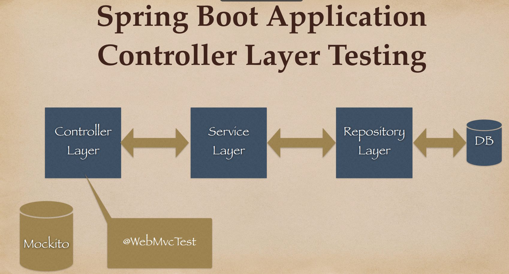
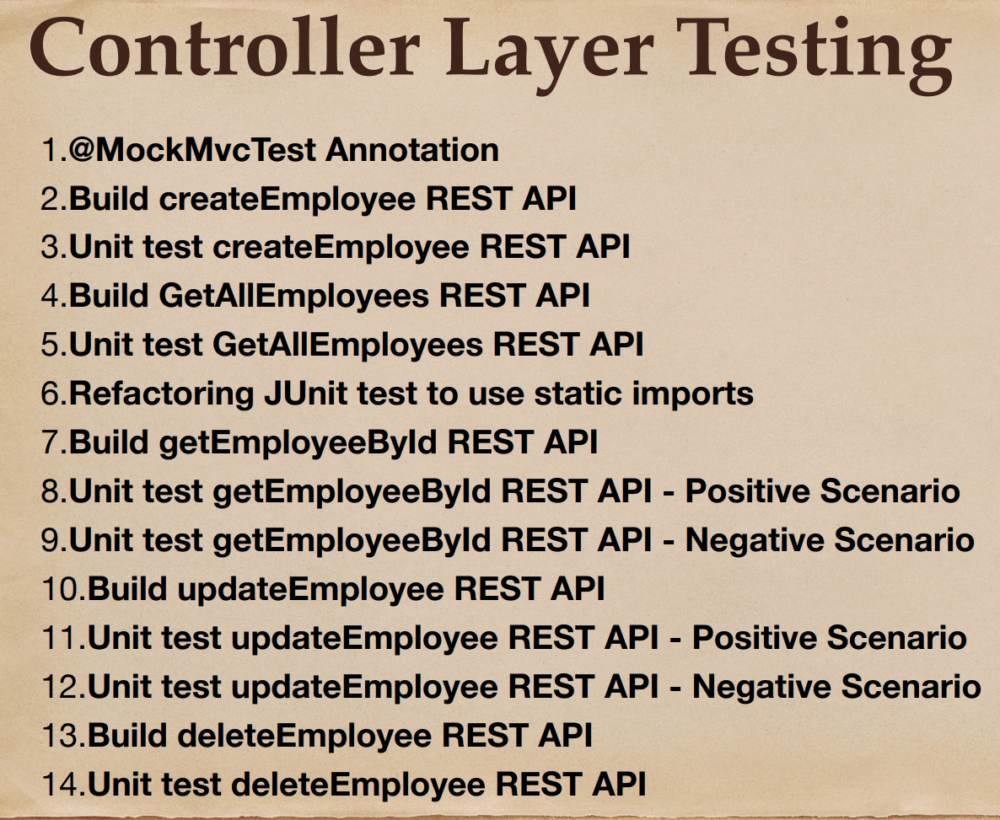
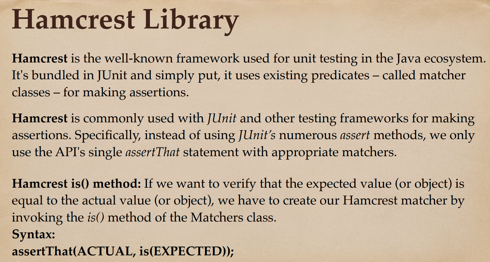
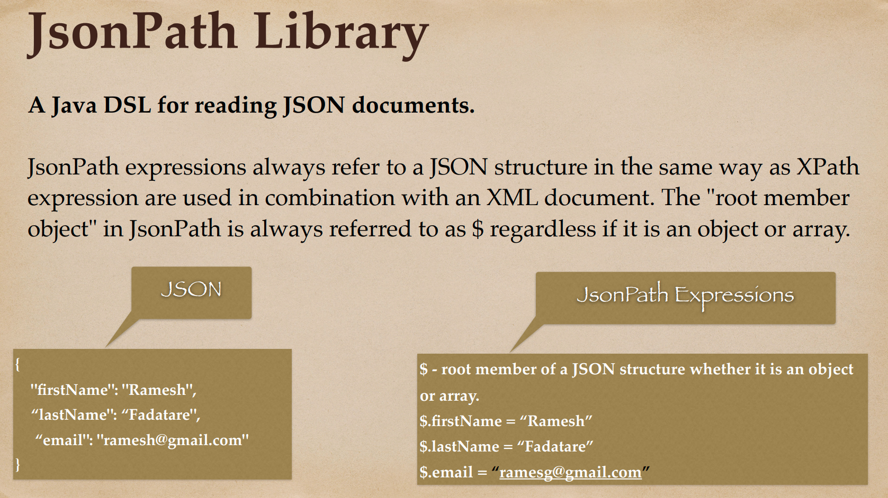
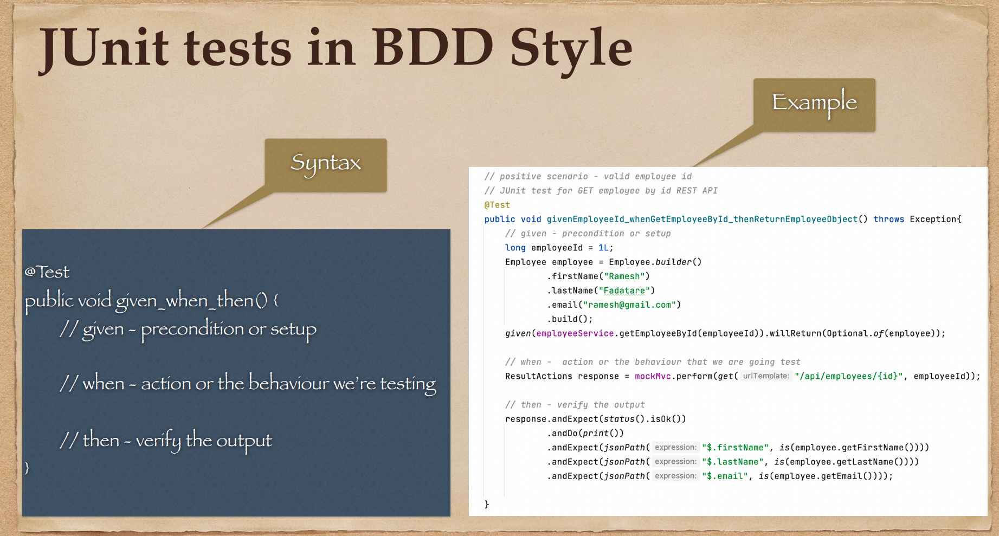
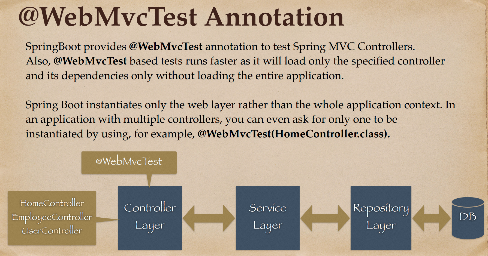
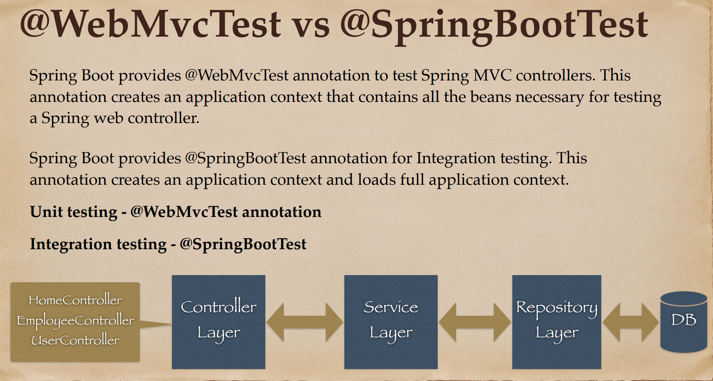
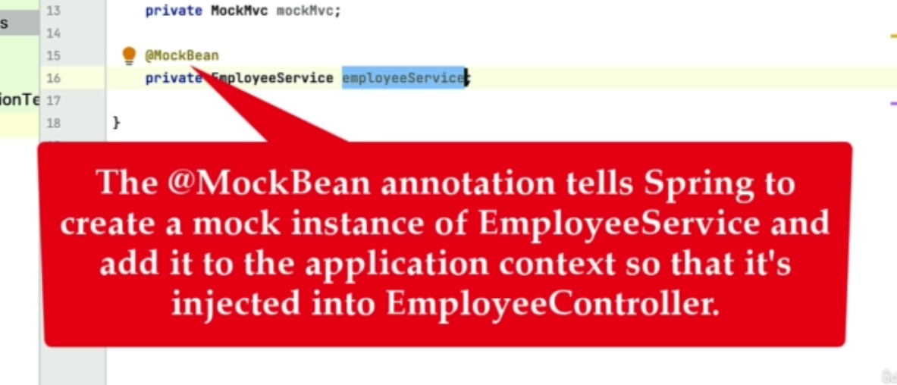

# 05 - Spring Boot - Unit Test Controller Layer (Unit Test REST APIs)

## 001 Controller Layer unit testing overview







## 002 Overview of @WebMvcTest annotation



## 003 @WebMvcTest VS @SpringBootTest



## 004 Build createEmployee REST API

```java
package com.wchamara.springboottesting.controller;

import com.wchamara.springboottesting.model.Employee;
import com.wchamara.springboottesting.service.EmployeeService;
import org.springframework.http.HttpStatus;
import org.springframework.web.bind.annotation.*;

@RestController
@RequestMapping("/api/v1/employees")
public class EmployeeController {

    private final EmployeeService employeeService;

    public EmployeeController(EmployeeService employeeService) {
        this.employeeService = employeeService;
    }

    @PostMapping
    @ResponseStatus(HttpStatus.CREATED)
    public Employee createEmployee(@RequestBody Employee employee) {
        return employeeService.saveEmployee(employee);
    }
}

```

```http
###
POST http://localhost:8080/api/v1/employees
Content-Type: application/json

{
  "firstName": "chamara",
  "lastName": "weerasinghe",
  "email": "abc@gmail.com"
}

response

{
  "id": 1,
  "firstName": "chamara",
  "lastName": "weerasinghe",
  "email": "abc@gmail.com"
}

```

## 005 Unit test createEmployee REST API



## 006 Build GetAllEmployees REST API

```java
package com.wchamara.springboottesting.controller;

import com.fasterxml.jackson.databind.ObjectMapper;
import com.wchamara.springboottesting.model.Employee;
import com.wchamara.springboottesting.service.EmployeeService;
import org.hamcrest.CoreMatchers;
import org.junit.jupiter.api.BeforeEach;
import org.junit.jupiter.api.DisplayName;
import org.junit.jupiter.api.Test;

import org.mockito.ArgumentMatchers;
import org.mockito.BDDMockito;
import org.springframework.beans.factory.annotation.Autowired;
import org.springframework.boot.test.autoconfigure.web.servlet.WebMvcTest;
import org.springframework.boot.test.mock.mockito.MockBean;
import org.springframework.http.MediaType;
import org.springframework.test.web.servlet.MockMvc;
import org.springframework.test.web.servlet.ResultActions;
import org.springframework.test.web.servlet.result.MockMvcResultHandlers;
import org.springframework.test.web.servlet.result.MockMvcResultMatchers;


import static org.springframework.test.web.servlet.request.MockMvcRequestBuilders.post;

/**
 * This class is a test class for the EmployeeController.
 * It uses the Spring Boot Test framework to provide an environment for testing the controller.
 * It mocks the EmployeeService to isolate the controller for unit testing.
 * It uses the MockMvc to simulate HTTP requests to the controller.
 * It uses the ObjectMapper to convert the Employee objects to JSON format for the HTTP requests.
 */
@WebMvcTest(EmployeeController.class)
class EmployeeControllerTest {
    @Autowired
    MockMvc mockMvc;

    @MockBean
    private EmployeeService employeeService;

    @Autowired
    private ObjectMapper objectMapper;

    private Employee employee;

    /**
     * This method sets up the test environment before each test.
     * It creates a new Employee object that is used in the tests.
     */
    @BeforeEach
    void setUp() {
        employee = Employee.builder()
                .firstName("NewFirstName")
                .lastName("NewLastName")
                .email("new@gmail.com")
                .build();
    }

    /**
     * This test verifies that the createEmployee method of the EmployeeController works as expected.
     * It sets up the EmployeeService to return the Employee that is passed to it.
     * It then sends a POST request to the /api/v1/employees endpoint with the Employee as the body.
     * It verifies that the HTTP status is 201 Created and that the returned Employee has the same properties as the one that was sent.
     */
    @Test
    @DisplayName("Employee creation succeeds")
    void givenEmployee_whenCreateEmployee_thenEmployeeIsCreated() throws Exception {
        // given - precondition or setup
        BDDMockito.given(employeeService.saveEmployee(ArgumentMatchers.any(Employee.class))).willAnswer(invocation -> invocation.getArgument(0));

        // when action or the behaviour we are going to test
        ResultActions response = mockMvc.perform(
                post("/api/v1/employees")
                        .contentType(MediaType.APPLICATION_JSON)
                        .content(objectMapper.writeValueAsString(employee))
        );

        // then verify the output
        response.andExpect(MockMvcResultMatchers.status().isCreated())
                .andExpect(MockMvcResultMatchers.jsonPath("$.firstName", CoreMatchers.is(employee.getFirstName())))
                .andExpect(MockMvcResultMatchers.jsonPath("$.lastName", CoreMatchers.is(employee.getLastName())))
                .andExpect(MockMvcResultMatchers.jsonPath("$.email", CoreMatchers.is(employee.getEmail()))).andDo(
                        MockMvcResultHandlers.print()
                );
    }
}
```

The selected code is a unit test class for the `EmployeeController` in a Spring Boot application. The class is annotated with `@WebMvcTest(EmployeeController.class)`, which is a special test annotation provided by Spring Boot for testing MVC controllers. This annotation auto-configures the Spring MVC infrastructure for the test and restricts the application context to the controller under test.

```java
@WebMvcTest(EmployeeController.class)
class EmployeeControllerTest {
```

The class has three fields that are automatically injected by Spring Boot: `MockMvc`, `EmployeeService`, and `ObjectMapper`. `MockMvc` is used to send HTTP requests to the controller under test. `EmployeeService` is a mock of the service that the controller depends on, and `ObjectMapper` is used to convert objects to JSON format for the HTTP requests.

```java
@Autowired
MockMvc mockMvc;

@MockBean
private EmployeeService employeeService;

@Autowired
private ObjectMapper objectMapper;
```

The `setUp` method is annotated with `@BeforeEach`, which means it is run before each test. This method initializes an `Employee` object that is used in the tests.

```java
@BeforeEach
void setUp() {
    employee = Employee.builder()
            .firstName("NewFirstName")
            .lastName("NewLastName")
            .email("new@gmail.com")
            .build();
}
```

The `givenEmployee_whenCreateEmployee_thenEmployeeIsCreated` test verifies the `createEmployee` method of the `EmployeeController`. It sets up the `EmployeeService` to return the `Employee` that is passed to it. It then sends a POST request to the `/api/v1/employees` endpoint with the `Employee` as the body. It verifies that the HTTP status is 201 Created and that the returned `Employee` has the same properties as the one that was sent.

```java
@Test
@DisplayName("Employee creation succeeds")
void givenEmployee_whenCreateEmployee_thenEmployeeIsCreated() throws Exception {
    // given - precondition or setup
    BDDMockito.given(employeeService.saveEmployee(ArgumentMatchers.any(Employee.class))).willAnswer(invocation -> invocation.getArgument(0));

    // when action or the behaviour we are going to test
    ResultActions response = mockMvc.perform(
            post("/api/v1/employees")
                    .contentType(MediaType.APPLICATION_JSON)
                    .content(objectMapper.writeValueAsString(employee))
    );

    // then verify the output
    response.andExpect(MockMvcResultMatchers.status().isCreated())
            .andExpect(MockMvcResultMatchers.jsonPath("$.firstName", CoreMatchers.is(employee.getFirstName())))
            .andExpect(MockMvcResultMatchers.jsonPath("$.lastName", CoreMatchers.is(employee.getLastName())))
            .andExpect(MockMvcResultMatchers.jsonPath("$.email", CoreMatchers.is(employee.getEmail()))).andDo(
                    MockMvcResultHandlers.print()
            );
}
```

This test follows the Arrange-Act-Assert pattern, which is a common pattern for structuring unit tests. The "Arrange" part sets up the test, the "Act" part performs the action that is being tested, and the "Assert" part verifies the result.

## 007 Unit test GetAllEmployees REST API

## 008 Refactoring JUnit test to use static imports

## 009 Build getEmployeeById REST API

## 010 Unit test getEmployeeById REST API - Positive Scenario

## 011 Unit test getEmployeeById REST API - Negative Scenario

## 012 Build updateEmployee REST API

## 013 Unit test updateEmployee REST API - Positive Scenario

## 014 Unit test updateEmployee REST API - Negative Scenario

## 015 Build deleteEmployee REST API

## 016 Unit test deleteEmployee REST API
