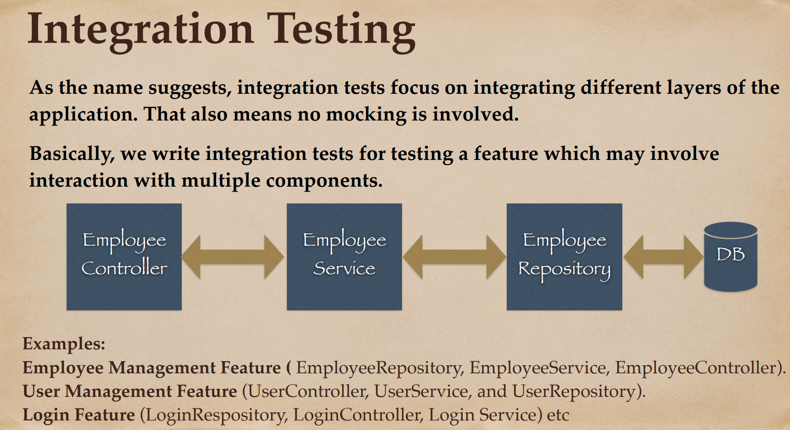
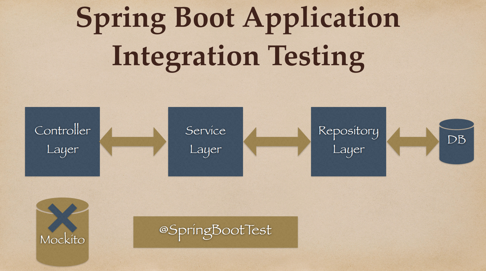
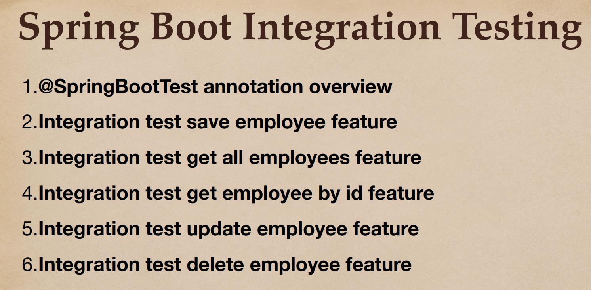
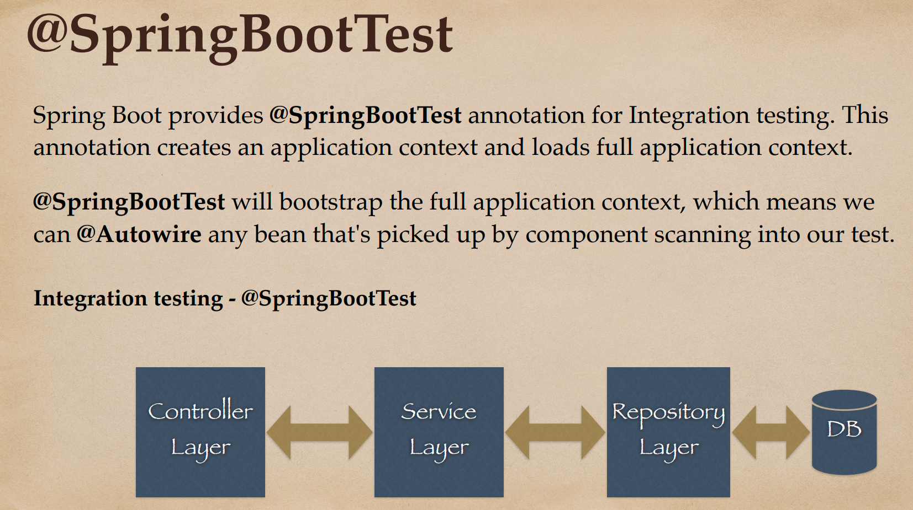
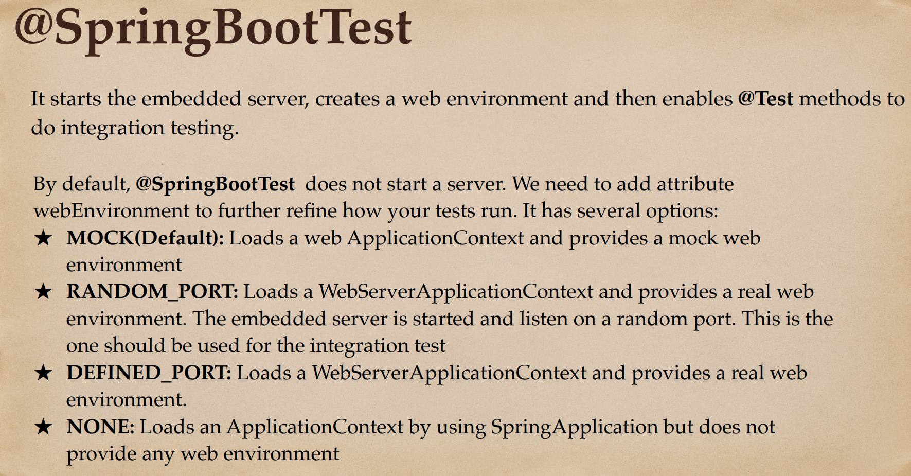
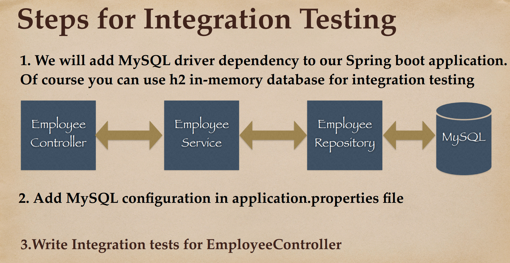
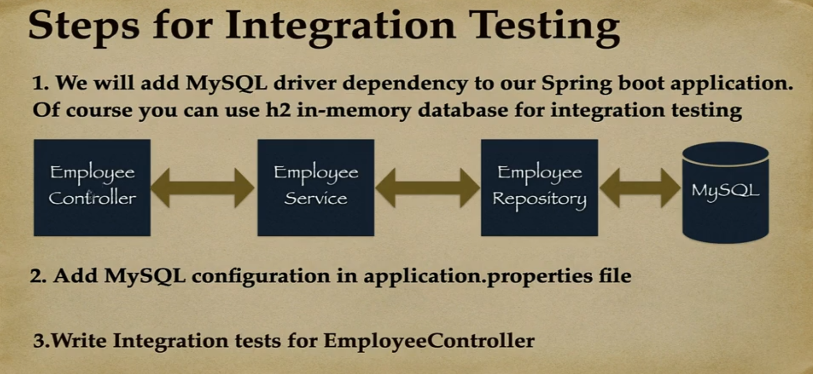

# 06 - Spring Boot - Integration Testing using Local MySQL Database

## 001 Integration testing overview





## 002 @SpringBootTest annotation overview





## 003 Configure MySQL database for integration testing



```xml
        <dependency>
            <groupId>org.springframework.boot</groupId>
            <artifactId>spring-boot-devtools</artifactId>
            <scope>runtime</scope>
            <optional>true</optional>
        </dependency>
```

in your local machine, you need to install MySQL database and create a database called `ems` and a table called `employee` with the following schema.

or create a docker compose file to create a MySQL database.

```yaml
version: '3.7'

services:
  db:
    image: mysql:8.3.0
    command:
      - --default-authentication-plugin=mysql_native_password
    restart: always
    ports:
      - "3306:3306"
    environment:
      MYSQL_ROOT_PASSWORD: root
      MYSQL_DATABASE: example
```

```bash
mysql -u root -p
```

```sql
create database ems;
```

let's add the following properties to the `application.properties` file.

```properties
spring.application.name=spring-boot-testing
spring.jpa.show-sql=true
spring.datasource.url=jdbc:mysql://127.0.0.1:3306/ems?useUnicode=true&characterEncoding=UTF-8&serverTimezone=UTC&useSSL=false
spring.datasource.username=root
spring.datasource.password=example
spring.datasource.driver-class-name=com.mysql.cj.jdbc.Driver
spring.jpa.hibernate.ddl-auto=update
```

The provided code is a configuration file (`application.properties`) for a Spring Boot application. This file is used to configure various aspects of the application. Here's a breakdown of what each line does:

- `spring.application.name=spring-boot-testing`: This sets the name of the Spring Boot application to "spring-boot-testing".

- `spring.jpa.show-sql=true`: This enables the logging of all SQL statements that Hibernate generates.

- `spring.datasource.url=jdbc:mysql://127.0.0.1:3306/ems?useUnicode=true&characterEncoding=UTF-8&serverTimezone=UTC&useSSL=false`: This sets the JDBC URL for the MySQL database. The URL specifies that the database is running on localhost (`127.0.0.1`) on port `3306` and the database name is `ems`. The additional parameters configure the connection properties.

- `spring.datasource.username=root` and `spring.datasource.password=example`: These set the username and password to connect to the MySQL database.

- `spring.datasource.driver-class-name=com.mysql.cj.jdbc.`: This sets the JDBC driver class name for MySQL. However, it seems to be incomplete. It should be `com.mysql.cj.jdbc.Driver`.

- `spring.jpa.hibernate.ddl-auto=update`: This property is used to automatically create, update, or even drop database tables based on the entity classes. The `update` value means that Hibernate will update the schema whenever it sees that changes are needed.


## 004 Create a base for Integration testing

## 005 Integration test for create employee REST API

## 006 Integration test for get all employees REST API

## 007 Integration test for get employee by id REST API - Positive & Negative Scenarios

## 008 Integration test for update employee REST API - Positive & Negative Scenarios

## 009 Integration test for delete employee REST API

## 010 Integration testing EmployeeRepository using MySQL database
