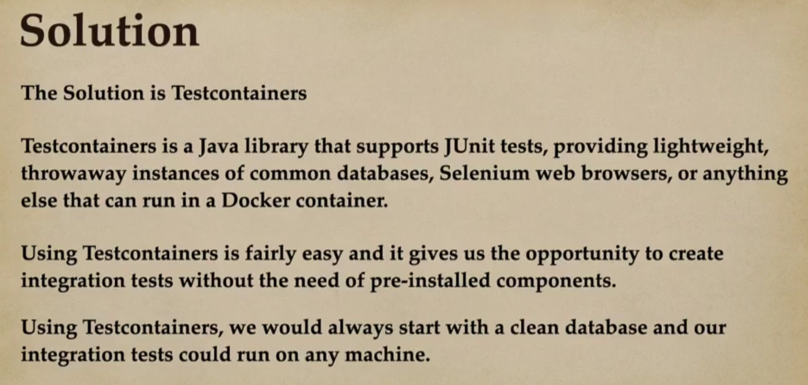

# 07 - Spring Boot - Integration Testing using Testcontainers

## 001 What problem does Testcontainers solve




## 002 Testcontainers overview


<https://java.testcontainers.org/>

<https://testcontainers.com/modules/mysql/>

## 003 Adding Testcontainers

<https://java.testcontainers.org/quickstart/junit_5_quickstart/>


```xml
        <dependency>
            <groupId>org.testcontainers</groupId>
            <artifactId>testcontainers</artifactId>
            <version>1.19.8</version>
            <scope>test</scope>
        </dependency>
        <dependency>
            <groupId>org.testcontainers</groupId>
            <artifactId>junit-jupiter</artifactId>
            <version>1.19.8</version>
            <scope>test</scope>
        </dependency>
        <dependency>
            <groupId>org.testcontainers</groupId>
            <artifactId>mysql</artifactId>
            <version>1.19.8</version>
            <scope>test</scope>
        </dependency>
```

## 004 Integration Testing EmployeeController using Testcontainers

## 005 Using @DynamicPropertySource

## 006 Singleton containers pattern

## 007 Integration Testing EmployeeRepository using Testcontainers
