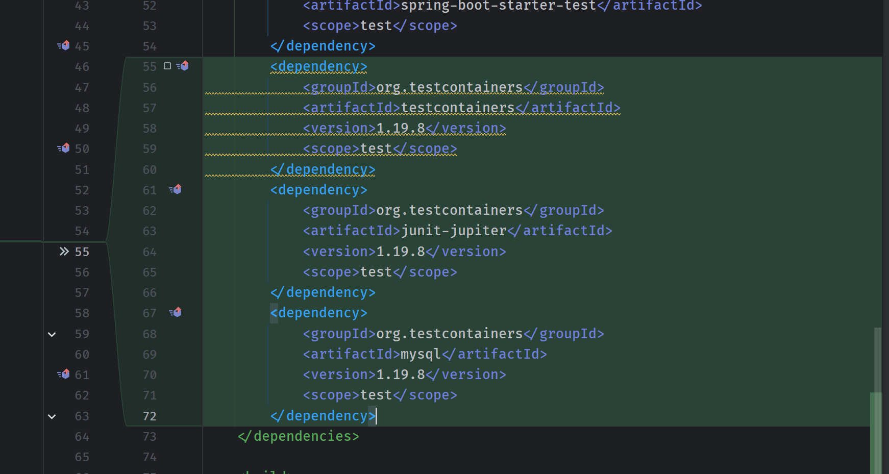

# 07 - Spring Boot - Integration Testing using Testcontainers

## 001 What problem does Testcontainers solve


## 002 Testcontainers overview


<https://java.testcontainers.org/>

<https://testcontainers.com/modules/mysql/>

## 003 Adding Testcontainers

<https://java.testcontainers.org/quickstart/junit_5_quickstart/>



```xml
        <dependency>
            <groupId>org.testcontainers</groupId>
            <artifactId>testcontainers</artifactId>
            <version>1.19.8</version>
            <scope>test</scope>
        </dependency>
        <dependency>
            <groupId>org.testcontainers</groupId>
            <artifactId>junit-jupiter</artifactId>
            <version>1.19.8</version>
            <scope>test</scope>
        </dependency>
        <dependency>
            <groupId>org.testcontainers</groupId>
            <artifactId>mysql</artifactId>
            <version>1.19.8</version>
            <scope>test</scope>
        </dependency>
```

## 004 Integration Testing EmployeeController using Testcontainers

```java
package com.wchamara.springboottesting.integration;

import com.fasterxml.jackson.databind.ObjectMapper;
import com.wchamara.springboottesting.model.Employee;
import com.wchamara.springboottesting.repository.EmployeeRepository;
import com.wchamara.springboottesting.util.FileUtil;
import org.junit.jupiter.api.BeforeEach;
import org.junit.jupiter.api.DisplayName;
import org.junit.jupiter.api.Test;
import org.slf4j.Logger;
import org.slf4j.LoggerFactory;
import org.springframework.beans.factory.annotation.Autowired;
import org.springframework.boot.test.autoconfigure.web.servlet.AutoConfigureMockMvc;
import org.springframework.boot.test.context.SpringBootTest;
import org.springframework.http.MediaType;
import org.springframework.test.web.servlet.MockMvc;
import org.springframework.test.web.servlet.ResultActions;
import org.testcontainers.containers.MySQLContainer;
import org.testcontainers.containers.output.Slf4jLogConsumer;
import org.testcontainers.junit.jupiter.Container;
import org.testcontainers.junit.jupiter.Testcontainers;
import org.testcontainers.utility.DockerImageName;

import java.util.List;

import static org.hamcrest.CoreMatchers.is;
import static org.springframework.test.web.servlet.request.MockMvcRequestBuilders.*;
import static org.springframework.test.web.servlet.result.MockMvcResultHandlers.print;
import static org.springframework.test.web.servlet.result.MockMvcResultMatchers.jsonPath;
import static org.springframework.test.web.servlet.result.MockMvcResultMatchers.status;

@SpringBootTest(webEnvironment = SpringBootTest.WebEnvironment.RANDOM_PORT)
@AutoConfigureMockMvc
@Testcontainers(
        disabledWithoutDocker = true
)
public class EmployeeControllerIT {
    private static final Logger logger = LoggerFactory.getLogger(EmployeeControllerIT.class);
    @Container
    private final static MySQLContainer mySQLContainer = new MySQLContainer<>(DockerImageName.parse("mysql:8.3.0"))
            .withPassword("example")
            .withUsername("root")
            .withDatabaseName("ems")
            .withLogConsumer(new Slf4jLogConsumer(logger));

    @Autowired
    EmployeeRepository employeeRepository;
    @Autowired
    ObjectMapper objectMapper;
    @Autowired
    private MockMvc mockMvc;

    @BeforeEach
    void setUp() {
        employeeRepository.deleteAll();
    }

    @Test
    @DisplayName("Employee creation integration succeeds")
    void givenEmployee_whenCreateEmployee_thenEmployeeIsCreated() throws Exception {

        System.out.println("JDBC URL: " + mySQLContainer.getJdbcUrl());
        System.out.println("Username: " + mySQLContainer.getUsername());
        System.out.println("Password: " + mySQLContainer.getPassword());
        System.out.println("Database Name: " + mySQLContainer.getDatabaseName());

        Employee employee = Employee.builder()
                .firstName("NewFirstName")
                .lastName("NewLastName")
                .email("new@gmail.com")
                .build();

        // when action or the behaviour we are going to test
        ResultActions response = mockMvc.perform(
                post("/api/v1/employees")
                        .contentType(MediaType.APPLICATION_JSON)
                        .content(objectMapper.writeValueAsString(employee))
        );

        // then verify the output
        response.andExpect(status().isCreated())
                .andExpect(jsonPath("$.firstName", is(employee.getFirstName())))
                .andExpect(jsonPath("$.lastName", is(employee.getLastName())))
                .andExpect(jsonPath("$.email", is(employee.getEmail()))).andDo(
                        print()
                );
    }

}
```

## 005 Using @DynamicPropertySource

```java
    @DynamicPropertySource
    static void dynamicProperties(DynamicPropertyRegistry registry) {
        registry.add("spring.datasource.url", mySQLContainer::getJdbcUrl);
        registry.add("spring.datasource.username", mySQLContainer::getUsername);
        registry.add("spring.datasource.password", mySQLContainer::getPassword);
    }

```


## 006 Singleton containers pattern

## 007 Integration Testing EmployeeRepository using Testcontainers
